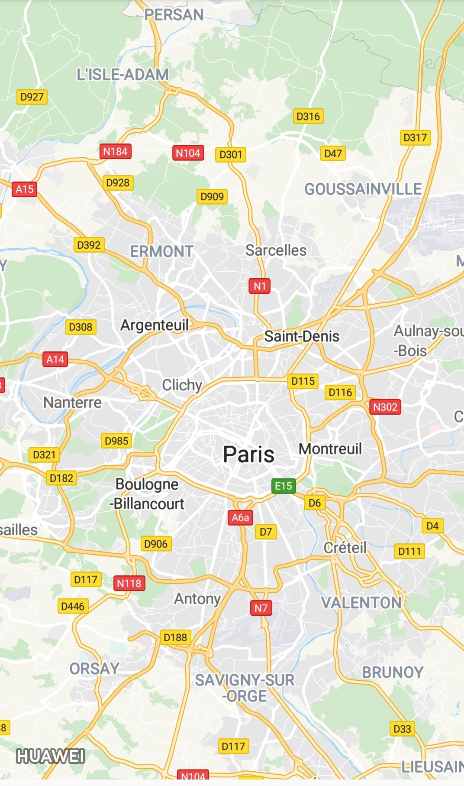
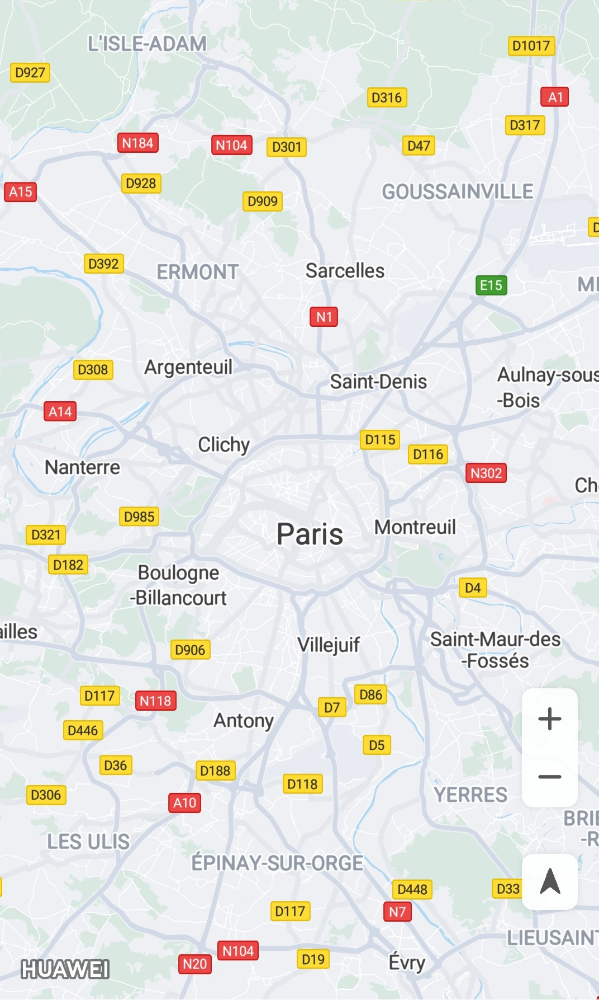
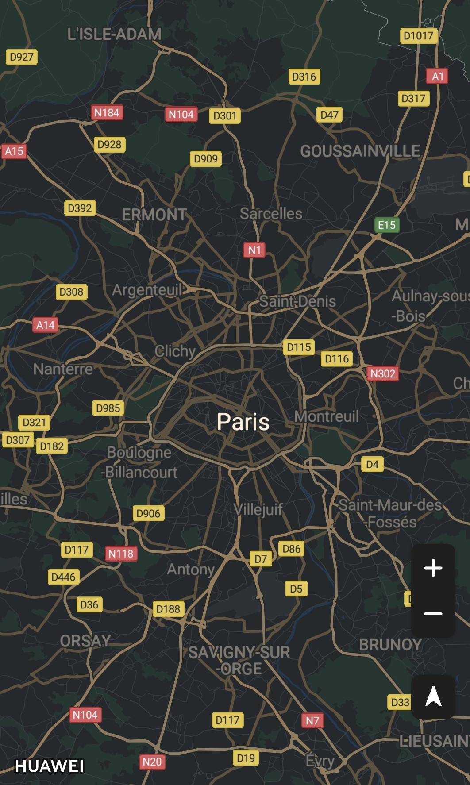

华为地图服务示例代码
===============================

中文 | [English](https://github.com/HMS-Core/hms-mapkit-demo-java/blob/master/README.md)

## 目录

 * [简介](#简介)
* [开发准备](#开发准备)
* [环境要求](#环境要求)
* [支撑](#支撑)
* [结果](#结果)
* [授权许可](#授权许可)

简介
------------

个性化你的地图显示以及与用户交互的方式，为用户量身打造地图使用体验。 让你的基于位置的服务更好的发挥作用，以便用户能够更好的使用你的应用。

华为地图服务使用WGS84 GPS坐标体系，满足绝大多数的海外地图开发需求，包括：

- 地图呈现：呈现内容包括建筑，道路，水系，兴趣点等。
- 地图交互：控制地图的交互手势和交互按钮。
- 地图绘制：添加位置标记，图层，覆盖物以及各种形状等。

开发准备
---------------

我们提供一个示例展示如何使用安卓版华为地图服务SDK。

该示例使用Gradle编译系统。

首先通过克隆该仓库或者下载压缩包的方式来下载示例代码。

在Android Stuido中，选择Open an existing Android Studio project，然后选择map-sample文件所在的目录。

你可以使用gradlew build命令来直接编译项目。

你应该在AppGallery Connect中创建一个应用，获取agconnect-services.json文件并将其加入到你的项目中。你还应生成一个签名证书指纹，将证书文件添加到你的项目中，并在build.gradle文件中添加配置。参见“[配置AppGallery Connect](https://developer.huawei.com/consumer/cn/doc/development/HMSCore-Guides-V5/android-sdk-config-agc-0000001050158641-V5)”在AppGallery Connect配置应用信息。

更多开发详情，请参见如下链接：

- [开发指南](https://developer.huawei.com/consumer/cn/doc/development/HMSCore-Guides-V5/android-sdk-introduction-0000001050158633-V5)
- [接口参考](https://developer.huawei.com/consumer/cn/doc/development/HMSCore-References-V5/maps-overview-0000001050151498-V5)

环境要求
-------

推荐Android SDK版本号为19或以上，JDK版本号为1.8或以上。

支撑
-------

如果你在使用过程中有任何问题或建议，欢迎访问如下链接给出你的建议或与我们交流：https://github.com/HMS-Core/hms-mapkit-demo-java/issues

## 结果

  

  

  

## 技术支持
如果您对HMS Core还处于评估阶段，可在[Reddit社区](https://www.reddit.com/r/HMSCore/)获取关于HMS Core的最新讯息，并与其他开发者交流见解。

如果您对使用HMS示例代码有疑问，请尝试：
- 开发过程遇到问题上[Stack Overflow](https://stackoverflow.com/questions/tagged/huawei-mobile-services)，在**huawei-mobile-services**标签下提问，有华为研发专家在线一对一解决您的问题。
- 到[华为开发者论坛](https://developer.huawei.com/consumer/cn/forum/blockdisplay?fid=18) HMS Core板块与其他开发者进行交流。

如果您在尝试示例代码中遇到问题，请向仓库提交[issue](https://github.com/HMS-Core/hms-nearby-demo/issues)，也欢迎您提交[Pull Request](https://github.com/HMS-Core/hms-nearby-demo/pulls)。

授权许可
-------

华为地图服务示例代码经过[Apache License 2.0](https://github.com/HMS-Core/hms-mapkit-demo-java/blob/master/LICENSE)授权许可。
