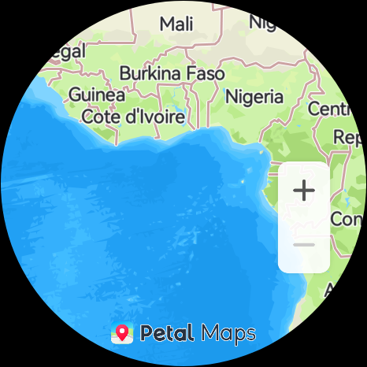

HMS Core Map Kit Sample Code
===============================

English | [中文](README_ZH.md)

## Contents

* [Introduction](#Introduction)
* [Preparations](#Preparations)
* [Environment Requirements](#Environment-Requirements)
* [Result](#Result)
* [Technical Support](#Technical-Support)
* [License](#License)

Introduction
------------

Map Kit allows you to customize your map display and the way for users to interact with your map, tailoring map use experience for your users. This can make location-based services in your app work better, empowering users to better use your app.

Map Kit uses the WGS84 GPS coordinate system, which meets most map development requirements outside China, including:

- Map display: Displays buildings, roads, water systems, Points of Interest (POIs), and others.
- Map interaction: Controls the interaction gestures and buttons on the map.
- Map drawing: Adds location markers, map layers, overlays, various shapes, and others.

Preparations
---------------

The sample code is built using Gradle to demonstrate how to use the Map SDK for HarmonyOS.

First, download the sample code by cloning this repository or downloading the compressed package.

In DevEco Studio, choose to open an existing DevEco Studio project and select the **harmonyos** directory.

You can run the **gradlew signReleaseHap** command to directly create a project.

Then, you need to create an app in AppGallery Connect, obtain the **agconnect-services.json** file, and add it to the project. You also need to generate a signing certificate fingerprint, add the signing certificate file to the project, and add related configurations to the **build.gradle** file. For details, please refer to [Configuring App Information in AppGallery Connect](https://developer.huawei.com/consumer/en/doc/development/HMSCore-Guides/harmonyos-sdk-config-agc-0000001101459188?ha_source=hms1).

To learn more, refer to the following documents:

- [Development Guide](https://developer.huawei.com/consumer/en/doc/development/HMSCore-Guides/harmonyos-sdk-introduction-0000001147819099?ha_source=hms1)
- [API Reference](https://developer.huawei.com/consumer/en/doc/development/HMSCore-References/harmonyos-package-summary-0000001101312574?ha_source=hms1)

Environment Requirements
-------

The Huawei smart watch must run HarmonyOS 2.0 or later, and has HMS Core (APK) 6.1.0 or later installed.

## Result

  

## Technical Support
You can visit the [Reddit community](https://www.reddit.com/r/HMSCore/) to obtain the latest information about HMS Core and communicate with other developers.

If you have any questions about the sample code, try the following:
- Visit [Stack Overflow](https://stackoverflow.com/questions/tagged/huawei-mobile-services?tab=Votes), submit your questions, and tag them with **huawei-mobile-services**. Huawei experts will answer your questions.
- Visit the HMS Core section in the [HUAWEI Developer Forum](https://forums.developer.huawei.com/forumPortal/en/home?fid=0101187876626530001) and communicate with other developers.

If you encounter any issues when using the sample code, submit your [issues](https://github.com/HMS-Core/hms-mapkit-demo/issues) or submit a [pull request](https://github.com/HMS-Core/hms-mapkit-demo/pulls).

License
-------

The sample code is licensed under [Apache License 2.0](https://github.com/HMS-Core/hms-mapkit-demo/blob/master/LICENSE).
