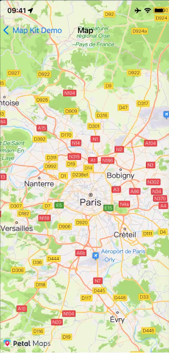
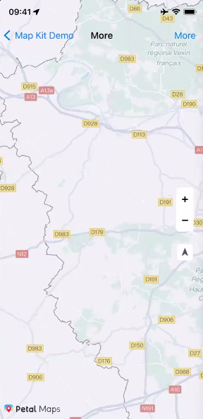
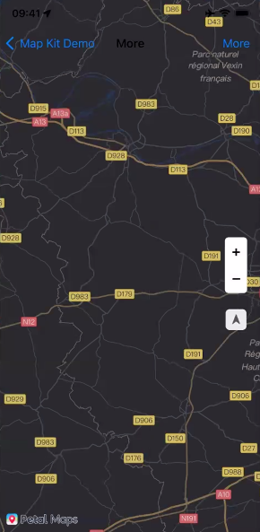

## 华为地图服务示例代码

## 目录
* [简介](#简介)
* [开发准备](#开发准备)
* [环境要求](#环境要求)
* [结果](#结果)
* [技术支持](#技术支持)
* [授权许可](#授权许可)

简介
------------
地图服务（Map Kit）给您提供一套地图开发调用的SDK，地图数据覆盖超过200个国家和地区，支持70+种地图展示与搜索语言，方便您轻松地在应用中集成地图相关的功能，全方位提升用户体验。

Map Kit不断优化丰富地图的细节呈现能力，例如在小比例尺展示情况下，能够清晰地看到绿地和植被信息；在POI和路网信息展示方面，根据POI属性信息及区域路网差异，在不同层级比例尺条件下，为用户展示更合适的POI和路网信息。手势交互方面，提供了包括缩放、旋转、移动、倾斜等流畅的交互体验。

海外地图采用WGS84 GPS坐标系，中国采用GCJ02坐标系，满足绝大多数地图开发的需求，包括：

- 地图呈现：呈现内容包括建筑、道路、水系、兴趣点等。
- 地图交互：控制地图的交互手势和交互按钮。
- 地图绘制：添加位置标记、图层、覆盖物以及各种形状等。

开发准备
---------------
在开发应用前，需要在AppGallery Connect中配置相关信息。

### 注册成为开发者
在开发应用前需要在[华为开发者联盟](https://developer.huawei.com/consumer/cn/)网站上注册成为开发者并完成实名认证，具体方法请参见[帐号注册认证](https://developer.huawei.com/consumer/cn/doc/start/registration-and-verification-0000001053628148)。

### 创建项目
参见[创建项目](https://developer.huawei.com/consumer/cn/doc/distribution/app/agc-help-createproject-0000001100334664)。

### 创建应用
在项目下[创建应用](https://developer.huawei.com/consumer/cn/doc/distribution/app/agc-help-createapp-0000001146718717)完成应用的创建，特殊配置如下：

- 选择平台：选择“iOS”。
- 软件包ID：您iOS应用的Bundle ID。
- 应用名称：仅用于应用管理，不会显示在终端用户界面上。
- App Store ID：您App Store Connect中的Apple ID。

### 打开相关服务
使用地图服务需要您在[AppGallery Connect](https://developer.huawei.com/consumer/cn/service/josp/agc/index.html)上打开“地图服务”，具体操作步骤请参见[开通服务](https://developer.huawei.com/consumer/cn/doc/distribution/app/agc-help-enabling-service-0000001146598793)。
更详细的开发指南请参考[iOS开发文档](https://developer.huawei.com/consumer/cn/doc/development/HMSCore-Guides/android-sdk-introduction-0000001197914654)

环境要求
-------

推荐iOS 11.0及以上

## 结果

  

  

  

## 技术支持
如果您对HMS Core还处于评估阶段，可在[Reddit社区](https://www.reddit.com/r/HMSCore/)获取关于HMS Core的最新讯息，并与其他开发者交流见解。

如果您对使用HMS示例代码有疑问，请尝试：
- 开发过程遇到问题上[Stack Overflow](https://stackoverflow.com/questions/tagged/huawei-mobile-services?tab=Votes)，在**huawei-mobile-services**标签下提问，有华为研发专家在线一对一解决您的问题。
- 到[华为开发者论坛](https://developer.huawei.com/consumer/cn/forum/blockdisplay?fid=18?ha_source=hms1) HMS Core板块与其他开发者进行交流。

如果您在尝试示例代码中遇到问题，请向仓库提交[issue](https://github.com/HMS-Core/hms-mapkit-demo-java/issues)，也欢迎您提交[Pull Request](https://github.com/HMS-Core/hms-mapkit-demo/pulls)。

授权许可
-------

华为地图服务示例代码经过[Apache License 2.0](https://github.com/HMS-Core/hms-mapkit-demo-java/blob/master/LICENSE)授权许可。
